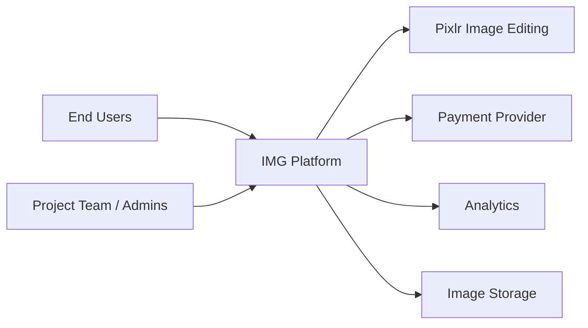
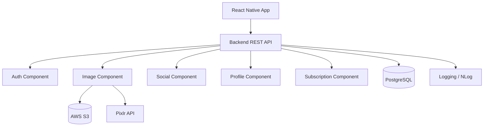
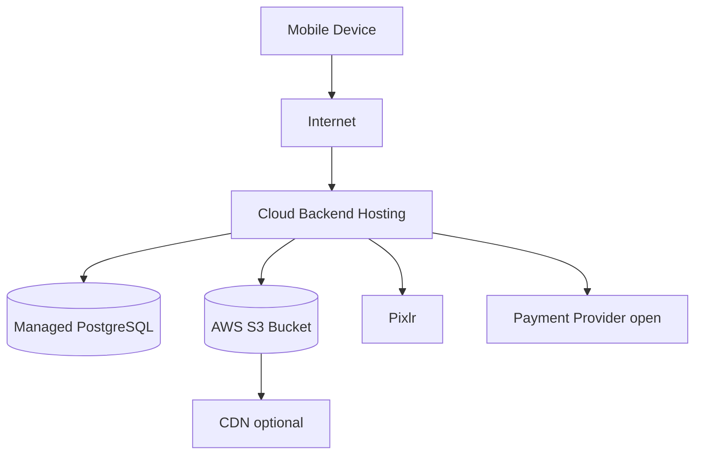
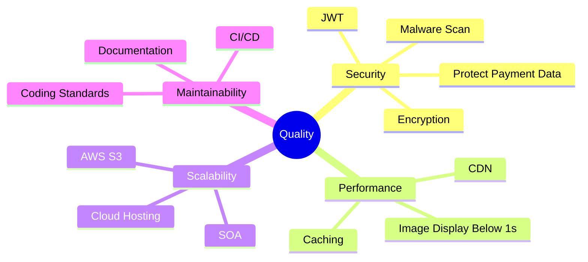

# arc42 Architecture Documentation: IMG GmbH Image-Sharing Platform

Version: 0.1  
Date: 2026-06-10  
Sources: `SWARC_1_IntroductionFinal.pptx`, `SWARC_2_Solutions_Risks(1).pptx`, `SWARC_3_Constraints.pdf`, `SWARC_4_Cross_Cutting_Concepts (2).pptx`, arc42 Template Overview (https://arc42.org/overview)

## 1. Introduction and Goals

### 1.1 Requirements Overview

IMG GmbH is developing an image-sharing platform. Users can upload images, share them publicly, view images, like them, and comment on content shared by other users. Users can also create profiles with image collections and social following features.

The platform provides a free tier with core functionality and a paid subscription model for advanced features. Image editing is provided through an integrated third-party service, Pixlr.

### 1.2 Quality Goals

| Priority | Quality Goal | Motivation |
| --- | --- | --- |
| 1 | Security | User credentials and payment data must be encrypted and stored securely to comply with the law. Uploaded files must be scanned for malicious content and viruses. |
| 2 | Performance | Users must be able to upload images and browse or view high-resolution images with minimal latency (< 1s, even during peak usage). |
| 3 | Availability | The infrastructure must remain stable and scale to growing user loads with minimal downtime(99%), including more than 1000 users. |

### 1.3 Stakeholders

| Stakeholder | Role | Expectations |
| --- | --- | --- |
| Hussin Abo Shaar | Project Manager / Client | Image-sharing platform with image-editing and community feature. Adherence to budget and timeline. |
| End Users | Photography Enthusiasts | High-quality editing tools, community features, and a curated feed. |
| Rohit Birdi | Lead Developer | Clear technical requirements, realistic deadlines, and clear team communication. |
| Diego Traxler | UX/UI Designer | Clear visual requirements and consistent UX/UI testing with various users for feedback. |
| Leopold Kant | Marketing Manager | Strong brand identity, concise target audience, and analytics for data gathering. |

## 2. Architecture Constraints

| Constraint | Description | Architectural Impact |
| --- | --- | --- |
| Team size | The team consists of 5 people. | Tasks must be prioritized clearly and distributed evenly. Architecture and processes must remain manageable. |
| Budget | The budget limits the usage of external services such as cloud infrastructure or automation. | Paid services must be used deliberately; build-vs-buy decisions must be justified. |
| Time | Time is critical due to budget reasons and the need to satisfy shareholders and investors. | Focus on pragmatic solutions, reuse of existing services, and fast validation. |
| Storage space | Storage capacity and user capacity are limited by the budget. | Image storage, compression, lifecycle rules, and CDN usage are central architectural concerns. |
| Third-party tool Pixlr | The image-editing features that can be implemented depend heavily on the external Pixlr service. | Dependency on the third party's availability, API, cost model, and data protection conditions. |

## 3. Context and Scope

### 3.1 Business Context

| Communication Partner | Relationship to the System |
| --- | --- |
| End Users | Register, manage profiles, upload images, edit images, like content, and comment on content. |
| Pixlr | External service for advanced image editing. |
| Payment Provider | Handles the subscription model and payment data protection. The concrete provider is still open. |
| Analytics | Provides data collection for marketing and product decisions. The concrete solution is still open. |
| Image Storage / CDN | Stores and delivers high-resolution images. AWS S3 is planned, ideally combined with CDN delivery. |
| Project Team / Admins | Operate, monitor, and maintain the platform, content, and infrastructure. |

### 3.2 Technical Context

The platform consists of a React Native frontend, .NET-based backend services, a PostgreSQL database, and cloud-based image storage. Communication is handled through HTTP and REST APIs. CI/CD is implemented with GitLab Actions.

## 4. Solution Strategy

| Goal / Requirement | Architectural Approach |
| --- | --- |
| System architecture | Service-oriented architecture (SOA) to structure functionality in a modular way and support future scalability. |
| Technology stack | React Native for the frontend, .NET for the backend, PostgreSQL as the relational database, Node.js in supporting tooling or service areas, HTTP/REST for interfaces. |
| Image storage | High-resolution images are stored in AWS S3 buckets. |
| Image editing | Advanced image editing is integrated through Pixlr instead of being built in-house initially. |
| Authentication | JWT Bearer Tokens for stateless and scalable authentication. |
| Quality assurance | Unit tests, user test sessions, and stakeholder reviews. |
| Development process | Agile sprints, Git, CI/CD pipeline, coding standards, and documentation. |

## 5. Building Block View

### 5.1 Level 1: Overall System

### 5.2 Backend Building Blocks

| Building Block | Responsibility |
| --- | --- |
| REST API | Provides the central HTTP interfaces for app functionality. |
| Auth Component | Registration, login, JWT creation, authorization, and token validation. |
| Image Component | Upload, metadata management, image storage access, malware scanning, and Pixlr integration. |
| Social Component | Likes, comments, feeds, and interactions with shared images. |
| Profile Component | User profiles, image collections, and following relationships. |
| Subscription Component | Management of free-tier and paid-tier functionality. Payment integration still needs to be specified. |
| Persistence | Stores structured data in PostgreSQL. |
| Logging | Technical logging with NLog. |

## 6. Runtime View

### 6.1 Uploading an Image

1. The user selects an image in the app.
2. The app sends an upload request with a JWT to the backend API.
3. The backend validates the token, file type, file size, and user permission.
4. The file is scanned for malware and viruses.
5. The image is stored in AWS S3.
6. Metadata is persisted in PostgreSQL.
7. The backend returns the image ID and access information to the app.

### 6.2 Editing an Image

1. The user opens an existing image for editing.
2. The backend creates or brokers access to Pixlr.
3. The user edits the image through the external service.
4. The result is transferred back to the platform or stored again.
5. The new image version and metadata are stored.

Open point: The exact technical flow of the Pixlr integration must be specified based on the final Pixlr API.

### 6.3 Viewing, Liking, and Commenting on Images

1. The app requests the feed or image detail view through the REST API.
2. The backend reads image metadata, comments, likes, and access information.
3. Frequently accessed data, such as most liked or most viewed pages, can be cached.
4. Image data is delivered through S3/CDN.
5. Likes and comments are persisted through API endpoints.

## 7. Deployment View

| Infrastructure Element | Purpose |
| --- | --- |
| Mobile Device | Runs the React Native app. |
| Cloud Backend Hosting | Runs the .NET backend services. The concrete provider is still open. |
| Managed PostgreSQL | Persistent relational data storage. |
| AWS S3 | Storage for high-resolution images. |
| CDN | Accelerated image delivery, recommended because of the performance target below 1 second. |
| Pixlr | External image editing. |
| GitLab Actions | CI/CD pipeline for build, tests, and deployment. |

## 8. Crosscutting Concepts

### 8.1 Development and Collaboration

- Agile development in sprints.
- Git as version control system.
- CI/CD pipeline with GitLab Actions.
- Unified coding standards and technical documentation.
- Unit tests, user test sessions, and stakeholder reviews.

### 8.2 Architecture and Design Patterns

- API-driven development through REST APIs.
- MVC pattern in the backend where appropriate for the .NET structure.
- SOA as the overarching architectural approach.
- Caching for frequently requested data such as most liked or most viewed content.

### 8.3 Security

- Authentication and authorization with JWT Bearer Tokens.
- Secure storage and encryption of sensitive data, especially credentials and payment data.
- Malware and virus scanning for file uploads.
- Exception handling as an explicit crosscutting concept.
- Additional token invalidation for password changes, logout, and logout across multiple devices must be defined.

### 8.4 Logging and Operations

- Logging with NLog.
- Relevant events: login, upload, Pixlr integration, payment-related processes, errors, and security events.
- Logs must not contain sensitive data such as passwords, payment data, or complete tokens.

## 9. Architectural Decisions

### ADR-001: Service-Oriented Architecture Instead of Microservices

| Field | Content |
| --- | --- |
| Context | The platform should be modular and scalable, but it is developed by a small team with limited budget and time. |
| Alternatives | Monolith, microservices, SOA. |
| Decision | Use a service-oriented architecture (SOA). |
| Rationale | SOA provides clear functional separation and future scalability options without forcing the full operational complexity of distributed microservices from the beginning. |
| Consequences | Services and modules must be separated cleanly. Deployment can initially remain simpler, while later extraction of individual services remains possible. |

### ADR-002: AWS S3 for Image Storage

| Field | Content |
| --- | --- |
| Context | The app must store and provide high-resolution images for potentially very many users. |
| Alternatives | Local file system, database BLOBs, cloud object storage. |
| Decision | Store images in AWS S3 buckets. |
| Consequences | Better scalability and faster delivery with CDN; additional cost per GB and dependency on AWS. |

### ADR-003: Pixlr as External Editing Service

| Field | Content |
| --- | --- |
| Context | Users need advanced editing tools. Building them in-house exceeds the startup's budget and timeline. |
| Alternatives | In-house implementation, another SaaS provider, Pixlr. |
| Decision | Integrate Pixlr as an external image editing service. |
| Consequences | Faster development and lower cost; dependency on Pixlr availability, API stability, and pricing. |

### ADR-004: JWT-Based Authentication

| Field | Content |
| --- | --- |
| Context | The app needs to authenticate users across the supported platforms. |
| Alternatives | Server sessions, OAuth/OIDC provider, JWT Bearer Tokens. |
| Decision | Use JWT Bearer Tokens. |
| Consequences | Stateless and scalable authentication; token invalidation for logout, password changes, and multiple devices requires additional logic. |

## 10. Quality Requirements

### 10.1 Quality Tree

### 10.2 Quality Scenarios

| Quality | Scenario | Acceptance Criteria |
| --- | --- | --- |
| Security | A user uploads an image file. | The file is scanned for malware before publication. |
| Security | An attacker gains access to database data. | Passwords and payment data are not stored in plain text. |
| Performance | A user opens the feed with high-resolution images. | Relevant content is displayed in under 1 second under normal load. |
| Scalability | The number of users grows beyond 1000 active users. | The system remains stable and can be extended with minimal downtime. |
| Maintainability | A new feature is developed. | The CI/CD pipeline runs tests and prevents faulty deployments. |

## 11. Risks and Technical Debt

| Risk / Technical Debt | Description | Mitigation |
| --- | --- | --- |
| Dependency on Pixlr | Image editing depends on a third-party provider. API changes, outages, or price increases can affect core functionality. | Encapsulate the integration, define fallback behavior, and review provider terms regularly. |
| Cloud and storage cost | High-resolution images can significantly increase storage and transfer cost. | Introduce storage limits, compression, lifecycle rules, monitoring, and budget alerts. |
| JWT token invalidation | Stateless JWTs are difficult to invalidate immediately, e.g. after password changes or logout from all devices. | Define a refresh-token concept, token versioning, or a server-side blocklist for critical cases. |
| Malware in uploads | The upload feature can be abused to upload malicious files. | Introduce malware scanning, file type validation, size limits, and a quarantine process. |
| Incompletely specified external services | Payment provider, analytics, and concrete hosting environment are not final yet. | Add architectural decisions once providers are selected. |

## 12. Glossary

| Term | Meaning |
| --- | --- |
| AWS S3 | Cloud object storage for large files such as images. |
| CDN | Content Delivery Network for fast delivery of static content. |
| CI/CD | Continuous Integration and Continuous Deployment for automating build, test, and deployment. |
| JWT | JSON Web Token; token format for stateless authentication and authorization. |
| NLog | Logging framework for .NET applications. |
| Pixlr | External service for image editing. |
| PostgreSQL | Relational open-source database. |
| React Native | Framework for developing mobile apps. |
| REST API | HTTP-based interface for resources and actions. |
| SOA | Service-oriented architecture; architectural approach for functional and technical modularization. |
